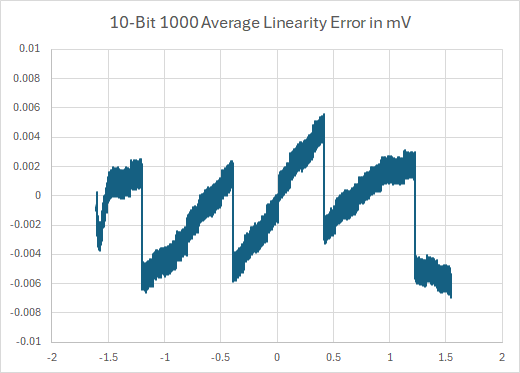

# breaking_linearity
Use Delta Sigma conversion to reduce ADC differential linearity errors.
This is an educational project for the Raspberry Pi Pico.

Initial Linearity in mV.

A block diagram of the process.

Linearity after Delta-Sigma conversion.

Linearity with an error curve subtraction.
